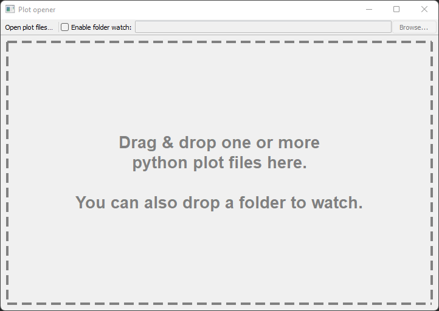

# Python interactive plot opener
Utility for loading pickled Python interactive plots from disk. Allows Python code to be run on one machine (server) and plots to be opened on another (client) machine. This is especially useful when the server does not support a GUI (e.g. Python running on WSL on Windows 10).

### Features
- Drag and drop support.
- Watch folder for new plot files and automatically open newly created graphs.
- Cross-platform.

### Usage
- Requires matplotlib and pyqt5 packages running with python3.
- On Windows, can be run as a single executable file by associating *.pyw files with pythonw.exe.
- Server should save plot files as follows:
    ```python
    import pickle
    import matplotlib.pyplot as plt
    
    with open('my_plot.pkl', 'wb') as pickle_file:
        pickle.dump(plt.gcf(), pickle_file)
    ```
### Screenshot


### Limitations
- Server and client may need to use the same version of matplotlib and/or python.
